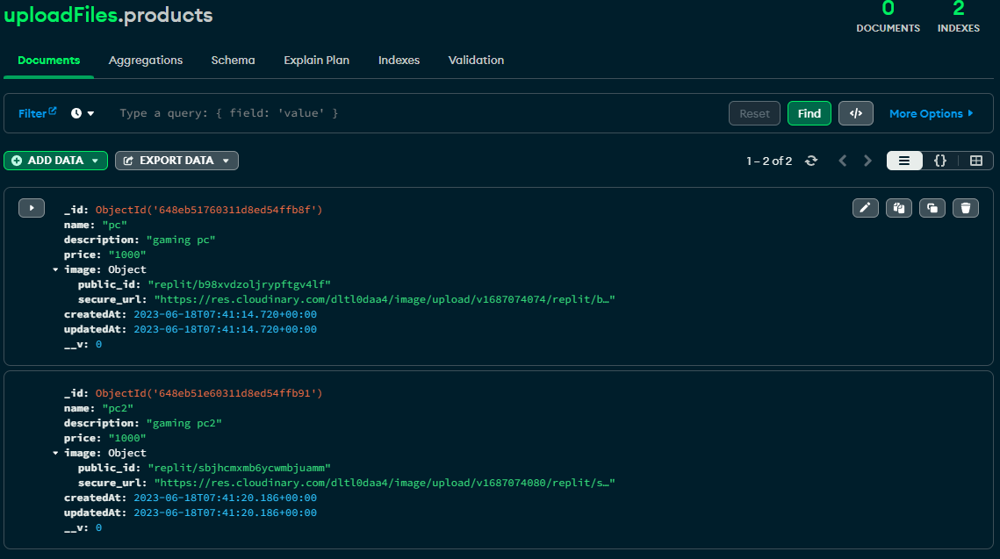

<h1 align="center">Welcome to restserver 👋</h1>
<p>
  <a href="https://www.npmjs.com/package/restserver" target="_blank">
    
  </a>
  <a href="#" target="_blank">
    
  </a>
</p>

> Proyecto para poder subir y eliminar imagenes a cloudinary con Node + MongoDB
> 

## Install

```sh
yarn install
```

## Usage

```sh
yarn run start
```
